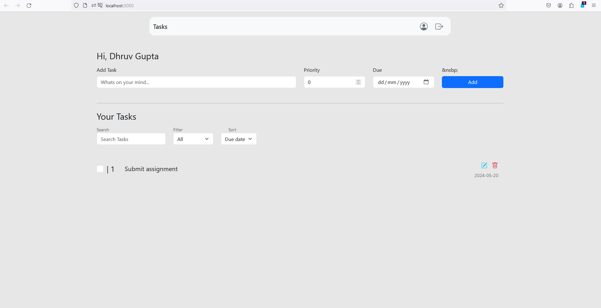

# Task Management App

## Backend
### Authentication
The app supports two types of authentication, email based and Google Oauth based authentication. 

I have used Node.js as javascript runtime environment and Express.js as the backend framework. I have used MongoDB as the database, JWT for token based authentication, passport.js for Google OAuth 2.0 authentication and nodemailer for sending emails.

<strong>The backend is hosted on Microsoft Azure and it may take a few seconds to load the first time due to cold start.</strong>

- For email based authentication, I have implemented two factor authentication that sends an OTP to the user's email for verification using nodemailer..
- I have also implemented real time email notifications for all account activities, including login events, password modifications etc.
- For the Google-based authentication, I have used Google OAuth 2.0 to authenticate users, whenever a google based authentication is triggered, the API redirects the user to the google login page and after successful login, the user is redirected back to the specified URL given to the API in the initial request with an authToken as a query parameter. This authToken can be interchanged with backend to obtain user details and perform further actions.

- Available API endpoints:
    1. ``` POST /auth/signup/email/verify - Signup Route: OTP verification and account creation ```
    2. ``` POST /auth/signup/email - Signup Route: Send OTP for email verification ```
    3. ``` POST /auth/signin - Signin Route: Login with email and password ```
    4. ``` POST /auth/verifyuser - Obtaining details from jwt token ```
    5. ``` POST /auth/forgot - Forgot Password Route: Send OTP for password reset ```
    6. ``` POST /auth/forgot/verify - Forgot Password Route: Verify OTP and reset password ```
    6. ``` GET /auth/google - To redirect to google login page ```


### Task Management
Simple CRUD operations are implemented for task management. 

- Available API endpoints:
    1. ``` GET /tasks : fetches all tasks of a user ```
    2. ``` POST /tasks/add : adds a task ```
    3. ``` POST /tasks/update/:id : updates a task by id ```
    4. ``` DELETE /tasks/delete/:id : deletes a task by id ```

### Local Setup
1. Clone the repository 
2. Run ```npm install``` to install all the dependencies
3. Create a .env file in the root directory and add the following environment variables:
    ```
    mongoURI=<your_mongo_uri>
    JWT_SECRET=<your_jwt_secret>
    EMAIL=<your_email>
    EMAIL_PASS_2=<your gmail app password>
    CLIENT_ID=<your_google_client_id>
    CLIENT_SECRET=<your_google_client_secret>
    ```

4. Run ```node index.js``` to start the server


## Frontend
The frontend is built using React.js and bootstrap. It is a simple web application that allows users to manage their tasks.

#### Local Setup
1. Clone the repository
2. Run ```npm install``` to install all the dependencies
3. Run ```npm start``` to start the server


